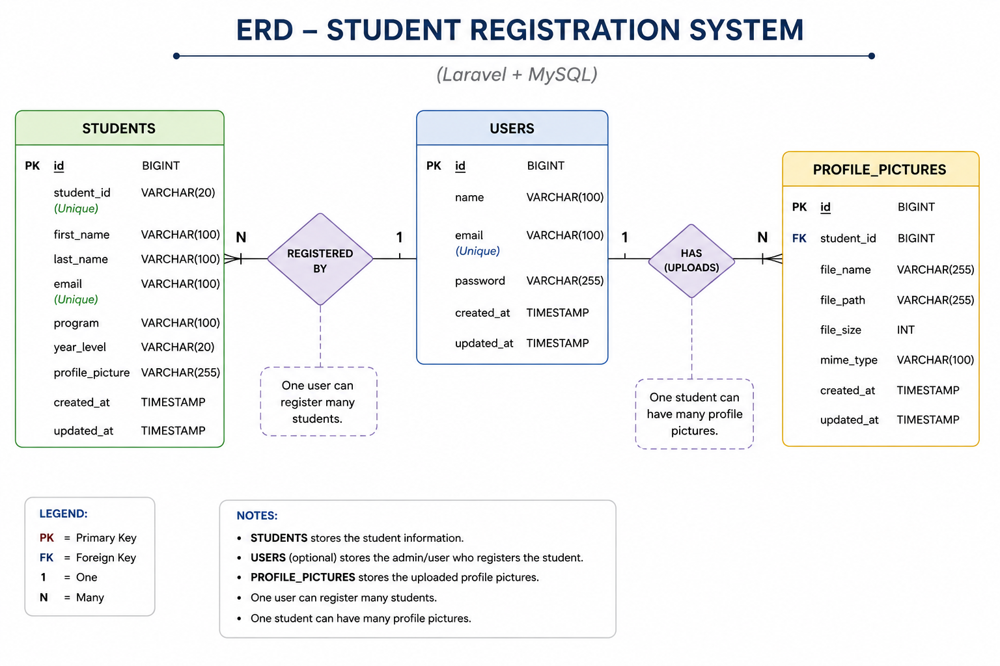
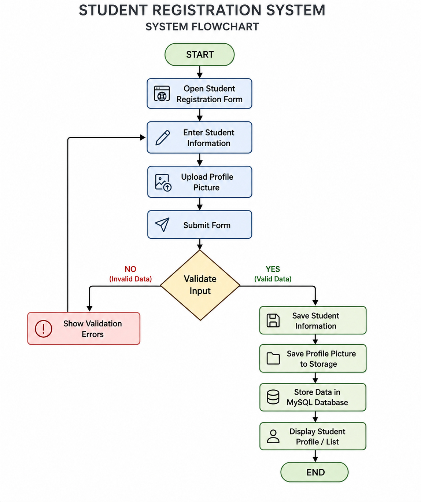
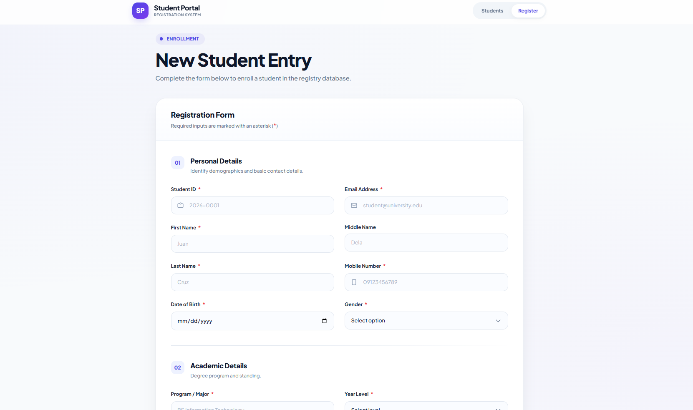
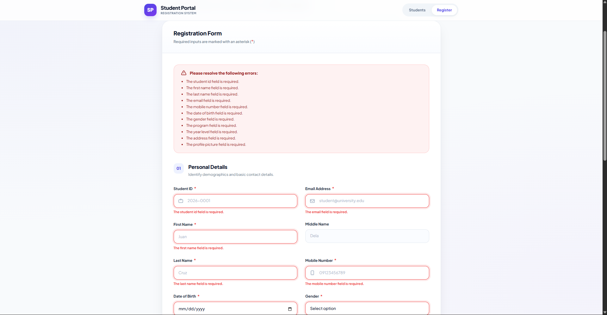
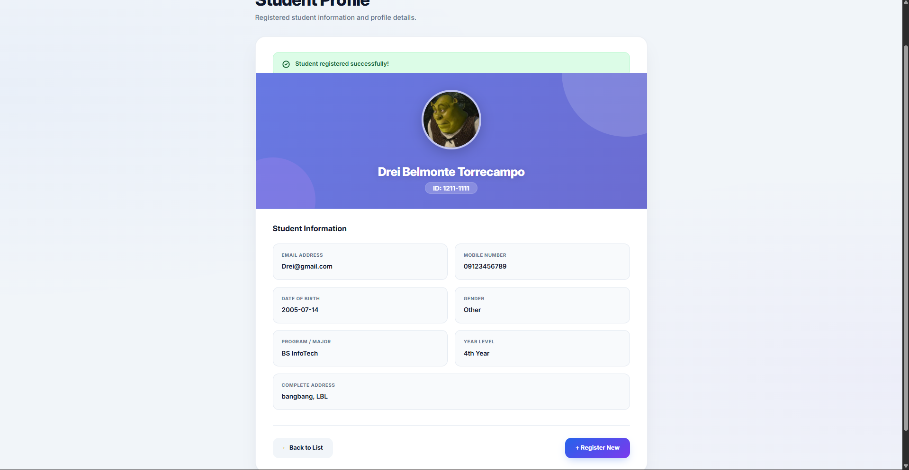
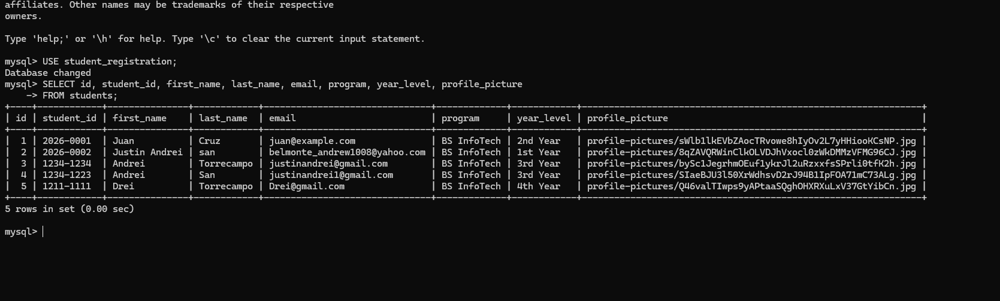
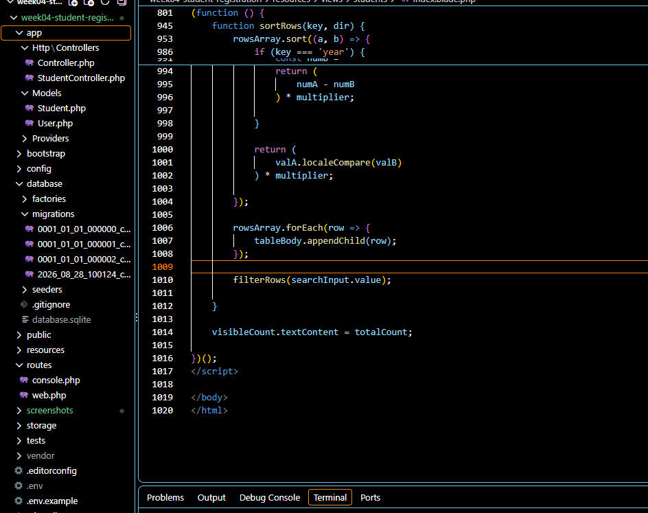
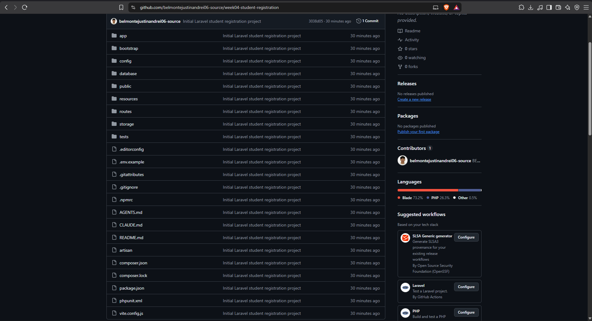
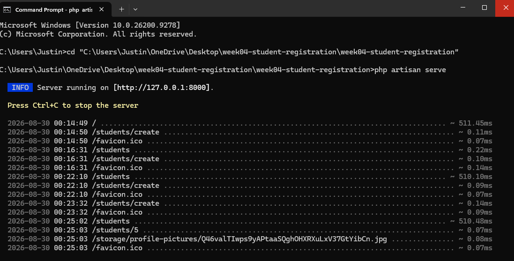
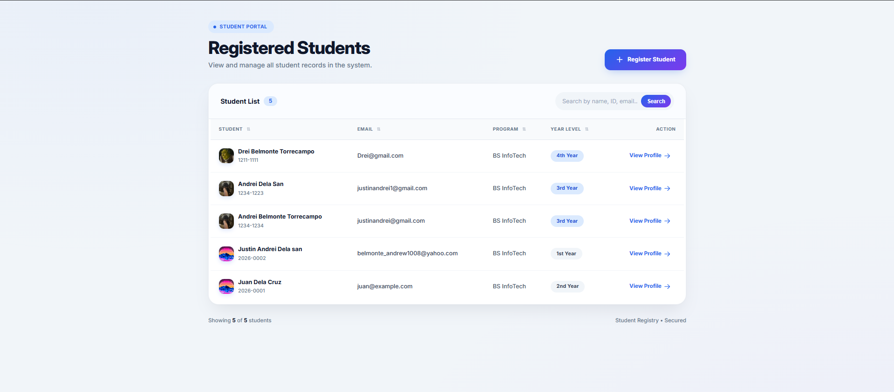

Absolutely bro. Replace your **entire `README.md`** with this clean version:

````markdown
# Week 04 – Student Registration System

A Laravel-based Student Registration System developed for the Week 04 Laboratory Activity in ITST 302 – Client-Server Technologies.

## 1. Project Title

### Student Registration System

**Course:** ITST 302 – Client-Server Technologies  
**Week:** 04  
**Project:** Mini Project 03 – Student Registration System  
**Framework:** Laravel  
**Database:** MySQL

## 2. Introduction

The Student Registration System is a web-based application developed using Laravel that allows users to register and manage student information digitally.

The application allows users to enter a student's personal and academic information, upload a profile picture, and view the registered student's profile after successful registration.

Laravel server-side validation is used to prevent incomplete, invalid, or duplicate information from being stored in the database.

This project demonstrates Laravel forms, request handling, server-side validation, flash messages, file uploads, Laravel Storage, database migrations, controllers, Blade templates, and MySQL integration.

## 3. Objectives

After completing this activity, the following objectives were accomplished:

- Create a student registration form using Laravel Blade.
- Implement server-side validation.
- Prevent duplicate Student IDs and email addresses.
- Validate email addresses and mobile numbers.
- Implement profile picture upload functionality.
- Store uploaded images using Laravel Storage.
- Store student information in MySQL.
- Display validation errors.
- Display success flash messages.
- Display registered student information.
- Use Laravel controllers to process requests.
- Use Git and GitHub for version control.
- Document the software development process using Markdown.

## 4. Laravel Request Lifecycle

The registration process follows this lifecycle:

```text
Browser
   ↓
Registration Form
   ↓
POST /students
   ↓
StudentController
   ↓
Validation
   ↓
Is the data valid?
   ├── No → Display validation errors
   │
   └── Yes
        ↓
   Save student information
        ↓
   Upload profile picture
        ↓
   Save image path
        ↓
   MySQL students table
        ↓
   Success message
        ↓
   Student Profile
        ↓
   Browser
````

## 5. Validation Rules

| Field           | Validation                                 |
| --------------- | ------------------------------------------ |
| Student ID      | Required and unique                        |
| First Name      | Required                                   |
| Middle Name     | Optional                                   |
| Last Name       | Required                                   |
| Email           | Required, valid email, unique              |
| Mobile Number   | Required and numeric                       |
| Date of Birth   | Required                                   |
| Gender          | Required                                   |
| Program         | Required                                   |
| Year Level      | Required                                   |
| Address         | Required                                   |
| Profile Picture | Required, image, JPG/JPEG/PNG, maximum 2MB |

## 6. Database Design

The application uses a MySQL `students` table.

| Column          | Type      | Constraint  |
| --------------- | --------- | ----------- |
| id              | BIGINT    | Primary Key |
| student_id      | VARCHAR   | Unique      |
| first_name      | VARCHAR   | Required    |
| middle_name     | VARCHAR   | Nullable    |
| last_name       | VARCHAR   | Required    |
| email           | VARCHAR   | Unique      |
| mobile_number   | VARCHAR   | Required    |
| date_of_birth   | DATE      | Required    |
| gender          | VARCHAR   | Required    |
| program         | VARCHAR   | Required    |
| year_level      | VARCHAR   | Required    |
| address         | TEXT      | Required    |
| profile_picture | VARCHAR   | Required    |
| created_at      | TIMESTAMP | Laravel     |
| updated_at      | TIMESTAMP | Laravel     |

### ERD



## 7. Registration Flowchart



## 8. Laravel Request Lifecycle Diagram

The Laravel request lifecycle begins when the browser submits the registration form. The request is processed through the route and controller, validated, stored in the database, and returned as a student profile.

```text
Browser
   ↓
Registration Form
   ↓
Route
   ↓
StudentController
   ↓
Validation
   ↓
Student Model
   ↓
MySQL Database
   ↓
Profile Picture Storage
   ↓
Success Response
   ↓
Student Profile
```

## 9. Screenshots

### Registration Form



### Validation Errors



### Successful Registration



### Database Records



### Project Structure



### GitHub Repository



### Terminal Output



### Browser Output



## 10. Problems Encountered and Solutions

### Profile Picture Not Displaying

The uploaded profile picture was successfully stored, but the image initially returned a `403 Forbidden` error when accessed through the browser.

The issue was resolved by creating Laravel's public storage link:

```powershell
php artisan storage:link
```

The uploaded file was also verified using Laravel Tinker:

```php
Storage::disk('public')->exists($student->profile_picture);
```

The result was:

```text
true
```

This confirmed that the uploaded file existed on the public storage disk.

### Wrong Project Directory

Running:

```powershell
php artisan serve
```

initially failed because the terminal was in the wrong directory.

After moving into the project directory containing the `artisan` file, the Laravel development server started successfully.

### Profile Image Path Issue

The profile picture was stored in the database, but the image could not initially be accessed from the browser. The database path and storage location were checked using Laravel Tinker.

The stored path was verified and the file was confirmed to exist on the `public` storage disk. The Laravel storage link was then configured so that files stored in `storage/app/public` could be accessed through the application's public directory.

## 11. Reflection

This Week 04 activity helped me understand how Laravel handles forms, validation, database operations, and file uploads.

One of the most important things I learned was the importance of server-side validation. A registration form should not simply accept any information entered by a user. Laravel validation allows the application to check whether required fields are completed, whether email addresses are valid, and whether unique fields such as Student ID and email already exist.

I also learned how Laravel handles user input. Information submitted through the registration form is received by the controller, validated according to the defined rules, and then processed before being stored in the database. This helps ensure that the application does not store incomplete or invalid information.

Another important lesson was file security. The profile picture feature required the uploaded image to be validated before it was stored. Restricting the accepted file types and maximum file size helps reduce the risk of unwanted or unsafe files being uploaded to the system.

I also learned how Laravel handles file uploads using Laravel Storage. The profile picture is stored separately from the database while the file path is saved with the student's record. I encountered a problem where the image existed but was not displaying because the public storage link was not available. Troubleshooting this issue helped me understand how Laravel connects the storage directory to the public directory.

Another important lesson was understanding the Laravel request lifecycle. The browser sends a request to a route, the route directs the request to the controller, the controller validates the information, and the model communicates with the database. Understanding this process makes it easier to organize Laravel applications and troubleshoot problems.

The project also improved my understanding of database design. The `students` table stores the student's personal and academic information, while unique constraints help prevent duplicate records.

Overall, the activity improved my practical knowledge of Laravel, MySQL, Blade templates, validation, file storage, and Git. These concepts can be applied to larger enterprise applications such as school management systems, employee systems, e-commerce applications, and other registration systems where accurate and secure user information is important.

## 12. References

* [Laravel Documentation](https://laravel.com/docs)
* [PHP Manual](https://www.php.net/docs.php)
* [MySQL Documentation](https://dev.mysql.com/doc/)
* [MDN Web Docs](https://developer.mozilla.org/)

## 13. Project Structure

```text
week04-student-registration/

├── app/
│   ├── Http/
│   │   └── Controllers/
│   │       └── StudentController.php
│   └── Models/
│       └── Student.php
│
├── bootstrap/
├── config/
│
├── database/
│   └── migrations/
│       └── 2026_08_28_100124_create_students_table.php
│
├── docs/
│   ├── Student_Registration_ERD.png
│   └── Student_Registration_Flowchart.png
│
├── public/
├── resources/
│   └── views/
│       └── students/
│           ├── create.blade.php
│           ├── index.blade.php
│           └── show.blade.php
│
├── routes/
│   └── web.php
│
├── screenshots/
│
├── storage/
├── tests/
├── artisan
├── composer.json
├── package.json
└── README.md
```

## 14. System Features

* Student registration
* Server-side validation
* Unique Student ID validation
* Unique email validation
* Email format validation
* Mobile number validation
* Profile picture upload
* JPG/JPEG/PNG image validation
* 2MB maximum image size
* MySQL database integration
* Student profile display
* Success flash messages
* Validation error messages
* Responsive user interface
* Laravel Storage integration

````

Save the file.

Then run:

```powershell
git status
````

Then:

```powershell
git add README.md
git commit -m "Polish README formatting and documentation"
git push
```

This will be **commit #6** and the README will be clean on GitHub.
